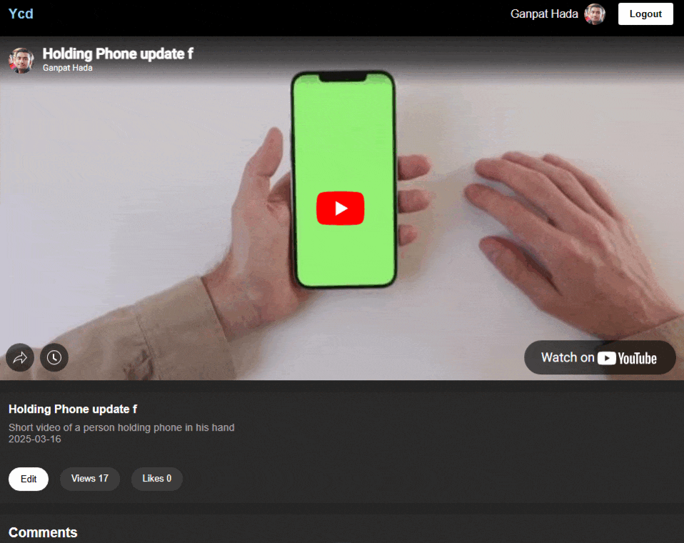

# YouTube Companion Dashboard

A React-based dashboard for YouTube creators to manage their videos, comments, and notes efficiently.

---



---

## Live Demo

Try the app online at: [YouTube Companion Dashboard](https://ycd.netlify.app/)

---

## Features

1. **Upload Unlisted Video**  
   - Upload an unlisted video directly to YouTube without using the API.  
   - Keep videos private until shared with a link.

2. **Video Details on Home Page**  
   - Automatically fetch and display details of uploaded videos via YouTube API.  
   - Shows video title, description, view count, and other metadata.

3. **Commenting System**  
   - Add comments on your video.  
   - Reply to any existing comment.  
   - Delete your own comments easily.  

4. **Edit Video Metadata**  
   - Change the title and description of your uploaded video from the dashboard.

5. **Notes Section**  
   - Maintain notes about your video ideas or improvements.  
   - Add tags to notes for easy categorization.  
   - Notes are stored in your own database for persistent storage.  

6. **Search & Tagging**  
   - Quickly search notes using tags to find specific ideas.  
   - Supports multiple tags per note and dynamic filtering.

7. **Dark Theme**  
   - Modern, responsive dark UI for better user experience.  

---

## Tech Stack

- **Frontend:** React, CSS, react-hot-toast  
- **Backend:** Node.js / Express for storing notes  
- **Authentication:** Google OAuth 2.0 for YouTube login  
- **State Management:** React Context API  

---

## Installation

1. Clone the repository:

```bash
git clone https://github.com/GanpatHada/YouTube-Companion-Dashboard.git
cd YouTube-Companion-Dashboard
```
2. Install the packages
```bash
npm install
```

3. add .env in your root folder

```bash
VITE_APP_YOUTUBE_API_KEY=<Your Api key>
```

3. Run

```bash
npm run dev
```

